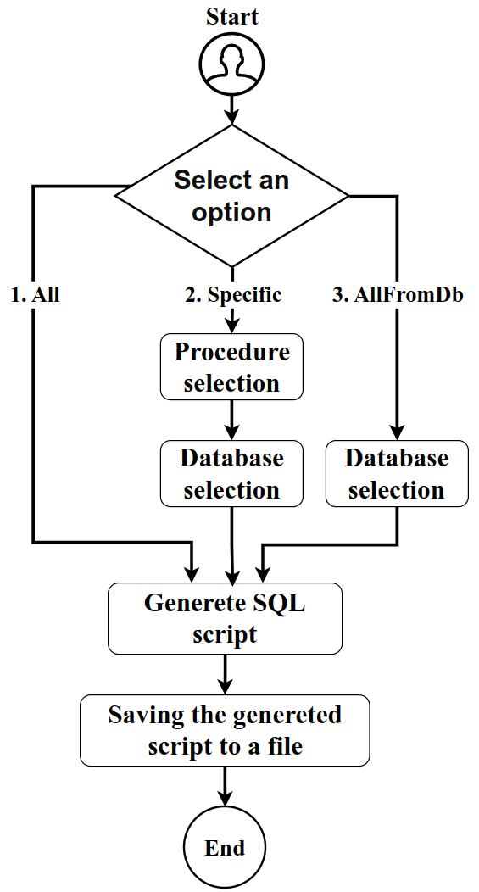
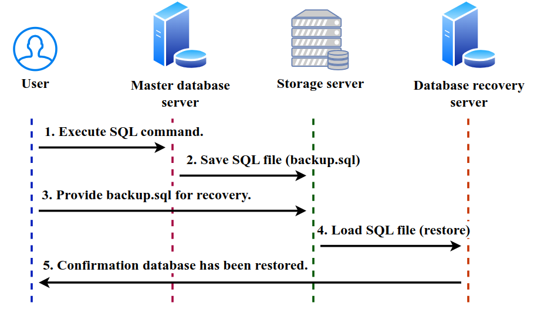

# flexmysqlbackup

[](https://opensource.org/licenses/MIT) <!-- Replace with your license if different -->

A flexible method and set of scripts for creating selective and cross-version compatible backups of MySQL databases, overcoming the limitations of the standard `mysqldump` utility.

## Summary

Creating backups in MySQL is critical for data management. The standard `mysqldump` tool, while useful, has limitations regarding selective object backups (triggers, views, procedures), compatibility between MySQL versions (e.g., issues with collations like `utf8mb4_0900_ai_ci` when migrating from 8.0 to 5.x), and the automatic inclusion of system schemas.

**flexmysqlbackup** offers an alternative approach based on:

*   Extracting metadata from `information_schema`.
*   Using stored procedures to generate SQL `CREATE` statements.
*   Bash scripts for automation and process management.
*   `sed` (Stream Editor) for fine-tuning formatting and ensuring compatibility of the generated scripts.

This method provides greater flexibility, selectivity, and reliability for backups and restores, especially in complex environments and during migrations between different MySQL versions.

## Key Features

*   **Selective Backup:** Ability to back up:
    *   Specific schemas (databases) or all (excluding system ones).
    *   Specific tables, all tables in a schema, or all tables in the system.
    *   Table data (using `mysqldump` commands generated by a procedure).
    *   Specific views, all views in a schema, or all in the system.
    *   Specific stored procedures/functions, all in a schema, or all in the system (via an interactive Bash script).
    *   Specific triggers, all in a schema, or all in the system.
    *   Specific events, all in a schema, or all in the system.
*   **Cross-Version Compatibility:** Generated scripts are designed for better compatibility when restoring on different MySQL versions (e.g., by removing `DEFINER`, allowing `CHARACTER SET`/`COLLATION` changes during table structure generation).
*   **Automation:** Uses Bash scripts for easy integration into automated backup processes.
*   **Flexibility:** Easily adaptable to specific needs (e.g., filtering by storage engine).
*   **System Schema Exclusion:** By default, does not include system schemas like `mysql`, `performance_schema`, etc., preventing issues when restoring on another server.

## Process Diagrams

### Procedure/Function Backup (Option Selection)


*Figure 3: Flowchart for the `process_sql_opt.sh` script execution.*

### Unified Backup and Restore Process


*Figure 5: General diagram of the backup and restore process.*

## Prerequisites

*   **MySQL Server:** Access to the MySQL server to be backed up.
*   **MySQL Client:** Installed `mysql` command-line client.
*   **Shell:** A Bash-compatible shell.
*   **sed:** The `sed` stream editor utility must be available (standard on most Linux/Unix systems).
*   **Permissions:** A MySQL user with sufficient privileges to read `information_schema` and object definitions (`SELECT`, `SHOW VIEW`, `SHOW CREATE PROCEDURE`, etc.), as well as privileges to run `mysqldump` (for data). For restoration, privileges to create objects (`CREATE`, `INSERT`, etc.) are required.

## Installation and Setup

1.  **Clone the repository:**
    ```bash
    git clone https://github.com/YOUR_USERNAME/flexmysqlbackup.git # <-- https://github.com/tuthon/flexmysqlbackup.git
    cd flexmysqlbackup
    ```

2.  **Create the Stored Procedures:**
    *   Connect to your MySQL server with a user having sufficient privileges.
    *   Create a database (schema) if needed (the article uses `tools`, but it can be anything):
        ```sql
        CREATE DATABASE IF NOT EXISTS tools;
        USE tools;
        ```
    *   Execute the `.sql` files containing the stored procedure definitions (`gen_schemes_script.sql`, `gen_table_script.sql`, `gen_data_sql_script.sql`, `gen_view_script.sql`, `gen_triggers_script.sql`, `gen_event_script.sql`) within the chosen schema (`tools` in the example):
        ```bash
        mysql -h YOUR_HOST -P YOUR_PORT -u YOUR_USER -p tools < gen_schemes_script.sql
        mysql -h YOUR_HOST -P YOUR_PORT -u YOUR_USER -p tools < gen_table_script.sql
        # ... execute for all .sql files containing procedures
        ```

3.  **Configure `process_sql_opt.sh`:**
    *   Open the `process_sql_opt.sh` file in a text editor.
    *   **RECOMMENDATION:** Instead of writing the password directly into the script, use a `.my.cnf` file or environment variables for more secure credential management. If you still decide to set them in the script (NOT RECOMMENDED FOR PUBLIC REPOSITORIES), find and fill in the variables:
        ```bash
        MYSQL_USER="your_db_user"
        MYSQL_HOST="your_db_host"
        MYSQL_PORT="your_db_port"
        # MYSQL_PWD="your_db_password" # Better to use .my.cnf or prompt
        ```
    *   Make the script executable:
        ```bash
        chmod +x process_sql_opt.sh
        ```

## Usage

**IMPORTANT:** All examples assume the stored procedures were created in the `tools` schema. If you used a different schema, replace `tools.` with `your_schema_name.`. Replace `-h... -P... -u... -p` with your actual connection parameters.

### 1. Backing Up Schemas (Databases)

*   **All schemas (excluding system ones):**
    ```bash
    mysql -hHOST -PPORT -uUSER -p --default-character-set=utf8mb4 --comments -e "CALL tools.gen_schemes_script(' ');" | sed '1d' > all_schemes.sql
    ```
*   **Specific schema:**
    ```bash
    mysql -hHOST -PPORT -uUSER -p --default-character-set=utf8mb4 --comments -e "CALL tools.gen_schemes_script('your_database_name');" | sed '1d' > specific_scheme.sql
    ```

### 2. Backing Up Table Structures

*   **All tables (excluding system ones):**
    ```bash
    mysql -hHOST -PPORT -uUSER -p --default-character-set=utf8mb4 --comments -e "CALL tools.gen_table_script(1, ' ', ' ', ' ', ' ', ' ');" | sed 's/\\n/\n/g' | sed '1d' > all_tables_structure.sql
    ```
*   **All tables in a specific schema:**
    ```bash
    mysql -hHOST -PPORT -uUSER -p --default-character-set=utf8mb4 --comments -e "CALL tools.gen_table_script(1, 'your_database_name', ' ', ' ', ' ', ' ');" | sed 's/\\n/\n/g' | sed '1d' > db_tables_structure.sql
    ```
*   **Specific table in a specific schema:**
    ```bash
    mysql -hHOST -PPORT -uUSER -p --default-character-set=utf8mb4 --comments -e "CALL tools.gen_table_script(1, 'your_database_name', 'your_table_name', ' ', ' ', ' ');" | sed 's/\\n/\n/g' | sed '1d' > specific_table_structure.sql
    ```
*   **Filter by Engine (e.g., only InnoDB):**
    ```bash
    mysql -hHOST -PPORT -uUSER -p --default-character-set=utf8mb4 --comments -e "CALL tools.gen_table_script(1, ' ', ' ', 'InnoDB', ' ', ' ');" | sed 's/\\n/\n/g' | sed '1d' > innodb_tables_structure.sql
    ```
*   **Change Charset/Collation during backup:**
    ```bash
    # Example: Changes all utf8mb4_0900_ai_ci to utf8mb4_general_ci
    mysql -hHOST -PPORT -uUSER -p --default-character-set=utf8mb4 --comments -e "CALL tools.gen_table_script(1, ' ', ' ', ' ', 'utf8mb4_0900_ai_ci', 'utf8mb4_general_ci');" | sed 's/\\n/\n/g' | sed '1d' > compatible_tables_structure.sql
    ```
    *(Parameters: `show_comments`, `database_name`, `table_name`, `engine_name`, `character_set_to_replace`, `collation_to_replace`)*

### 3. Backing Up Table Data

This process involves two steps: generating a `.sh` script and then executing it.

*   **Generate `all_data_script.sh` for all data (excluding system):**
    ```bash
    echo '#!/bin/bash' > all_data_script.sh
    mysql -hHOST -PPORT -uUSER -p -e "CALL tools.gen_data_script(' ', ' ', ' ');" --silent --raw --skip-column-names >> all_data_script.sh
    chmod +x all_data_script.sh
    ```
*   **Generate for a specific schema:**
    ```bash
    echo '#!/bin/bash' > db_data_script.sh
    mysql -hHOST -PPORT -uUSER -p -e "CALL tools.gen_data_script('your_database_name', ' ', ' ');" --silent --raw --skip-column-names >> db_data_script.sh
    chmod +x db_data_script.sh
    ```
*   **Generate for a specific table:**
    ```bash
    echo '#!/bin/bash' > table_data_script.sh
    mysql -hHOST -PPORT -uUSER -p -e "CALL tools.gen_data_script('your_database_name', 'your_table_name', ' ');" --silent --raw --skip-column-names >> table_data_script.sh
    chmod +x table_data_script.sh
    ```
*   **Execute the generated `.sh` script:**
    ```bash
    ./all_data_script.sh > all_data.sql
    # OR
    ./db_data_script.sh > db_data.sql
    # OR
    ./table_data_script.sh > table_data.sql
    ```
    *(Note: The generated `.sh` file will contain `mysqldump` commands. You might need to edit connection parameters within it if they differ from those used for generation, or if you are not using `.my.cnf`.)*

### 4. Backing Up Views

*   **All views:**
    ```bash
    mysql -hHOST -PPORT -uUSER -p --default-character-set=utf8mb4 --comments -e "CALL tools.gen_view_script(' ', ' ');" | sed 's/\\n/\n/g' | sed '1d' > all_views.sql
    ```
*   **All views in a specific schema:**
    ```bash
    mysql -hHOST -PPORT -uUSER -p --default-character-set=utf8mb4 --comments -e "CALL tools.gen_view_script('your_database_name', ' ');" | sed 's/\\n/\n/g' | sed '1d' > db_views.sql
    ```
*   **Specific view in a specific schema:**
    ```bash
    mysql -hHOST -PPORT -uUSER -p --default-character-set=utf8mb4 --comments -e "CALL tools.gen_view_script('your_database_name', 'your_view_name');" | sed 's/\\n/\n/g' | sed '1d' > specific_view.sql
    ```

### 5. Backing Up Procedures and Functions

Use the interactive script `process_sql_opt.sh`.

```bash
./process_sql_opt.sh
Use code with caution.
Markdown
Follow the menu prompts:

All: Backs up all procedures/functions from all non-system databases. The output will be in a file like all_procedures.sql (check the script for the exact name).

Specific: Prompts for a procedure/function name and a database name. Backs up only that specific object.

AllFromDb: Prompts for a database name. Backs up all procedures/functions from that database.

6. Backing Up Triggers
All triggers:

mysql -hHOST -PPORT -uUSER -p --comments -e "CALL tools.gen_triggers_script(' ', ' ');" | sed 's/\\n/\n/g' | sed '1d' > all_triggers.sql
Use code with caution.
Bash
All triggers in a specific schema:

mysql -hHOST -PPORT -uUSER -p --comments -e "CALL tools.gen_triggers_script('your_database_name', ' ');" | sed 's/\\n/\n/g' | sed '1d' > db_triggers.sql
Use code with caution.
Bash
Specific trigger in a specific schema:

mysql -hHOST -PPORT -uUSER -p --comments -e "CALL tools.gen_triggers_script('your_database_name', 'your_trigger_name');" | sed 's/\\n/\n/g' | sed '1d' > specific_trigger.sql
Use code with caution.
Bash
7. Backing Up Events
All events:

mysql -hHOST -PPORT -uUSER -p --comments -e "CALL tools.gen_event_script(' ', ' ');" | sed 's/\\n/\n/g' | sed '1d' > all_events.sql
Use code with caution.
Bash
All events in a specific schema:

mysql -hHOST -PPORT -uUSER -p --comments -e "CALL tools.gen_event_script('your_database_name', ' ');" | sed 's/\\n/\n/g' | sed '1d' > db_events.sql
Use code with caution.
Bash
Specific event in a specific schema:

mysql -hHOST -PPORT -uUSER -p --comments -e "CALL tools.gen_event_script('your_database_name', 'your_event_name');" | sed 's/\\n/\n/g' | sed '1d' > specific_event.sql
Use code with caution.
Bash
Restore Process
CRITICAL: Due to dependencies between MySQL objects, restoration must follow a strict order:

Disable Event Scheduler (If used):

SET GLOBAL event_scheduler = OFF;
Use code with caution.
SQL
(Execute this on the target server where you will restore.)

Restore Schemas:

mysql -hTARGET_HOST -PPORT -uUSER -p < all_schemes.sql
Use code with caution.
Bash
Restore Table Structures:

mysql -hTARGET_HOST -PPORT -uUSER -p < all_tables_structure.sql
Use code with caution.
Bash
Restore Views:

mysql -hTARGET_HOST -PPORT -uUSER -p < all_views.sql
Use code with caution.
Bash
Restore Procedures and Functions:

# Ensure you use the correct file generated by process_sql_opt.sh
mysql -hTARGET_HOST -PPORT -uUSER -p --comments < all_procedures.sql
Use code with caution.
Bash
Restore Data:

# Ensure you use the correct file generated by the data *.sh script
mysql -hTARGET_HOST -PPORT -uUSER -p < all_data.sql
Use code with caution.
Bash
Restore Triggers:

mysql -hTARGET_HOST -PPORT -uUSER -p < all_triggers.sql
Use code with caution.
Bash
Restore Events:

mysql -hTARGET_HOST -PPORT -uUSER -p < all_events.sql
Use code with caution.
Bash
Enable Event Scheduler (If previously disabled):

SET GLOBAL event_scheduler = ON;
Use code with caution.
SQL
(Execute this on the target server after restoration.)

Comparison with mysqldump (Based on Tests)
File Size: flexmysqlbackup generates significantly smaller files for objects like procedures, functions, events, views, and triggers compared to a full mysqldump, as it only backs up the necessary CREATE statements without extra system settings. The data file size is the same, as it uses mysqldump internally for data extraction.

Backup/Restore Time: Results vary. In some scenarios (e.g., MySQL 8), flexmysqlbackup might be slightly faster overall. On older versions (e.g., 5.6), generating the backup with flexmysqlbackup might be slower due to multiple queries to information_schema, but the restore might be faster.

Compatibility: flexmysqlbackup successfully handles restoration between different versions (8.0 -> 5.6 and 5.6 -> 8.0 in tests), where mysqldump might require manual edits (e.g., due to collations).

Contributing
Contributions in the form of Pull Requests, bug reports, or feature suggestions are welcome. Please open an Issue on GitHub to discuss larger changes beforehand.

License
This project is licensed under the MIT License. 

Author
Dimitar Todorov - Initial work - tuthon@gmail.com